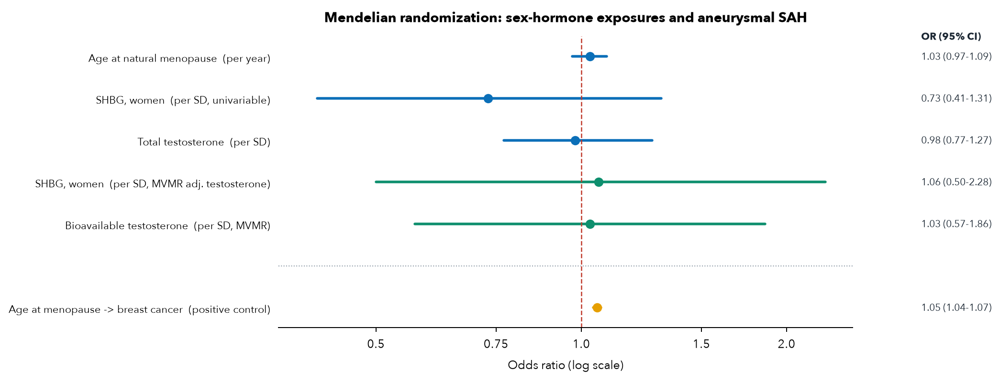

# Figures and tables

The display items from the study. The manuscript text and supplementary are not in
this repository (this is companion code, not the paper).

## Figure 1. Study design

Each arm as a Data → Design → Analysis pipeline.

## Figure 2. Results overview

The two designs, their weaknesses, their estimates, and the convergent conclusion.

## Figure 3. Mendelian-randomization forest

Sex-hormone exposures on aSAH, with the positive control.

## Table 1. Estimand comparison across the two designs

| | Arm 1, Observational (ICU) | Arm 2, Genetic (Mendelian randomization) |
|---|---|---|
| **Exposure** | Menopausal state (age-based proxy: <51 vs ≥51) | Genetically predicted age at natural menopause (Ruth 2021) |
| **Outcome node** | Delayed cerebral ischaemia / vasospasm, conditional on aSAH admission | aSAH liability (aneurysm rupture; Bakker 2020) |
| **Population** | Adults admitted to ICU with aSAH (MIMIC-IV + eICU) | European-ancestry participants of the source GWAS |
| **Dominant bias** | Confounding by age (exposure is defined by age); ICU selection | Horizontal pleiotropy of menopause variants |
| **Direction of bias** | Age raises vasospasm risk in the young, pushing the estimate *against* protection | Unknown; tested by Egger / MR-PRESSO / Steiger |
| **Can identify** | Whether menopausal state (mostly age) tracks DCI in admitted patients | Causal effect of menopausal timing on rupture, free of age confounding |
| **Cannot identify** | An estrogen effect separable from age; incidence | The DCI node (no DCI GWAS exists); a female-specific effect |
| **Result** | Adjusted OR 0.86 (0.58–1.28), non-identifiable | IVW OR 1.03/yr (0.97–1.09); excludes protection > OR 0.90/SD |
| **Validation** | Specification curve + age×sex difference-in-differences (null, 1.04) | Positive control ANM→breast cancer (OR 1.055/yr, P=1.8×10⁻²⁵) |

## Table 2. Mendelian-randomization results

Outcome is aneurysmal SAH (Bakker 2020, European, UK-Biobank-excluded) unless
stated. Random-effects IVW; distance clumping unless noted.

| Analysis | Exposure | Instruments | OR (95% CI) | P | Notes |
|---|---|---|---|---|---|
| Primary | Age at natural menopause, per year | 85 | 1.03 (0.97–1.09) | 0.32 | Steiger 80/85; Egger P 0.19; MR-PRESSO P 0.17; LOO 1.01–1.04; F 98 |
| Primary, per SD | Age at natural menopause, per SD | 85 | 1.12 (0.91–1.38) | — | 80% MDE OR 0.73; TOST excludes protection > OR 0.90/SD (P 0.027), not null/harm (0.53) |
| **Positive control** | Age at menopause → **breast cancer** | 207 | **1.055 (1.041–1.069)** | 1.8×10⁻²⁵ | recovers the established effect; validates the pipeline |
| Single-exposure | SHBG, women, per SD | 82 | 0.73 (0.41–1.31) | 0.29 | opposite side of null from Molenberg 2022 (1.18) |
| Single-exposure | Total testosterone, per SD | 58 | 0.98 (0.77–1.27) | 0.91 | Egger intercept P 0.04 |
| Multivariable | SHBG, women (adj. testosterone) | 106 | 1.06 (0.50–2.28) | 0.88 | SHBG point moves 0.73 → 1.06 when testosterone is held fixed |
| Multivariable | Bioavailable testosterone (adj. SHBG) | 106 | 1.03 (0.57–1.86) | 0.93 | |
| Sensitivity | Clumping windows 250 kb–5 Mb | 61–107 | 1.02–1.03 | — | stable to clumping stringency |
| Sensitivity | r² LD clumping (PLINK, 1000G EUR) | 81 | 1.03 (0.98–1.09) | 0.22 | gold-standard clumping confirms the primary |

## Graphical abstract

---

*Regenerate any figure with `python figures/<name>.py` (requires the analysis
outputs for data-driven figures; the design/abstract figures are self-contained).*
