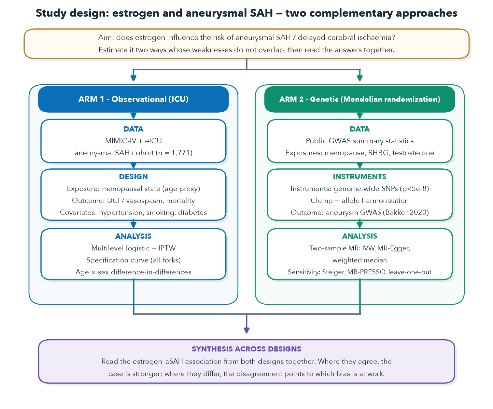
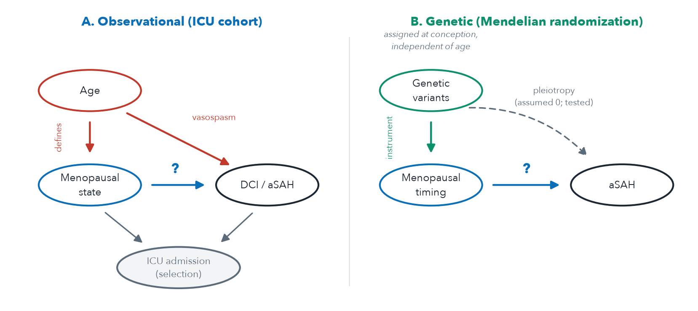
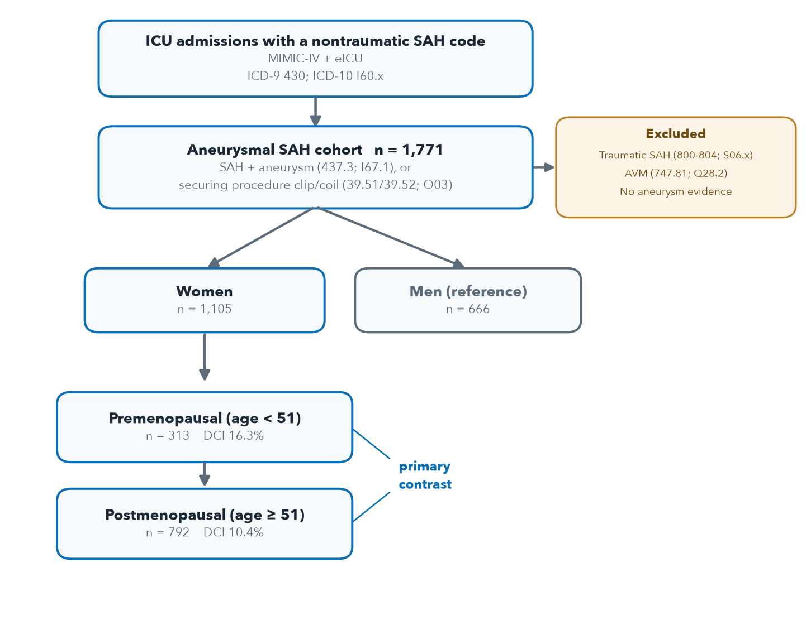
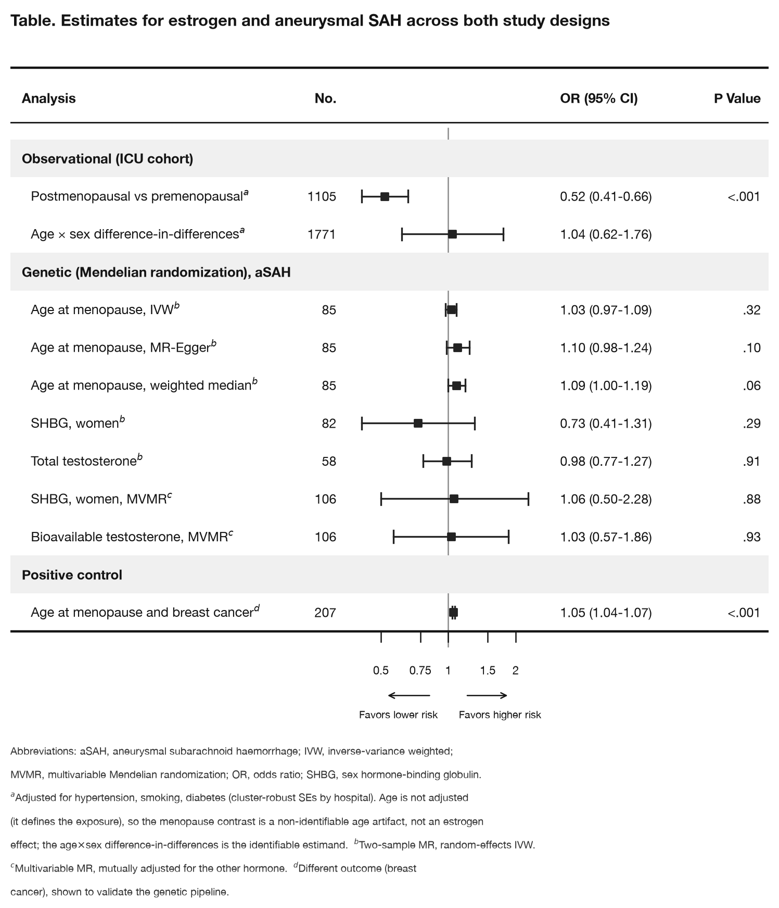
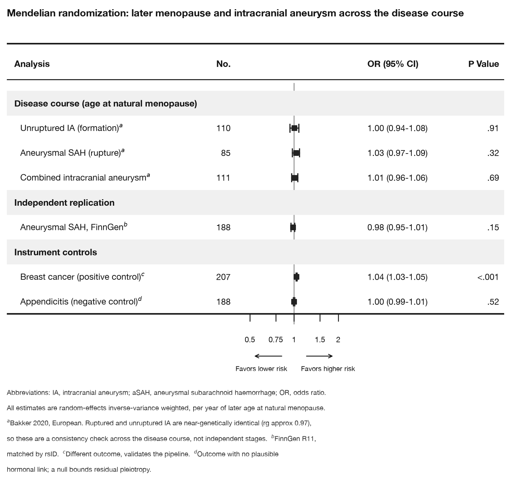
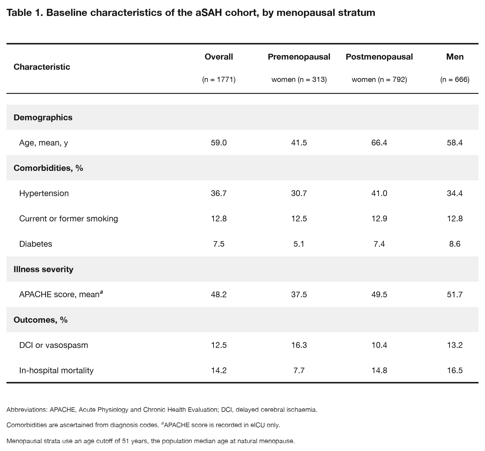
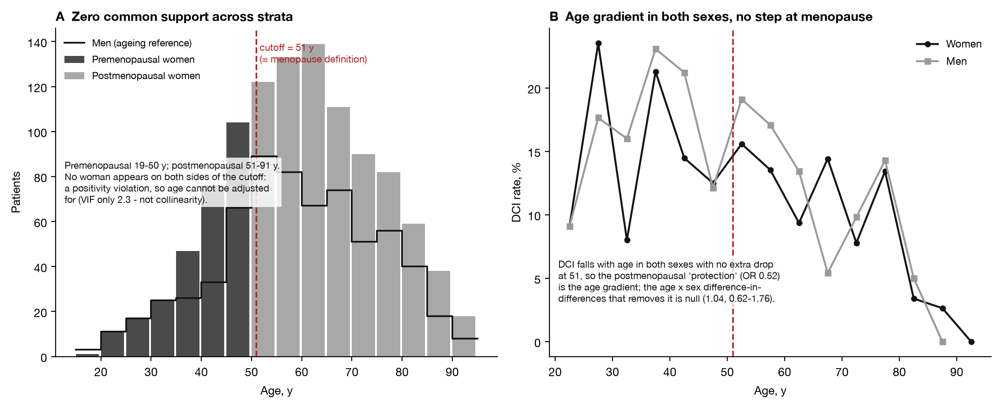
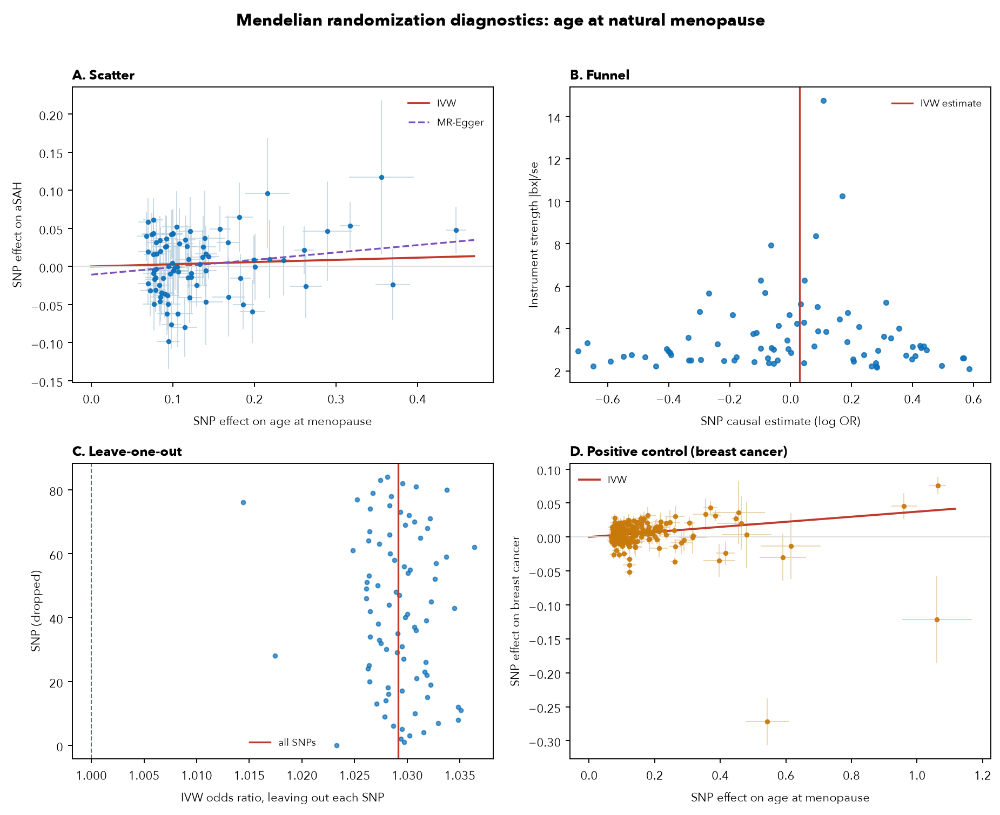
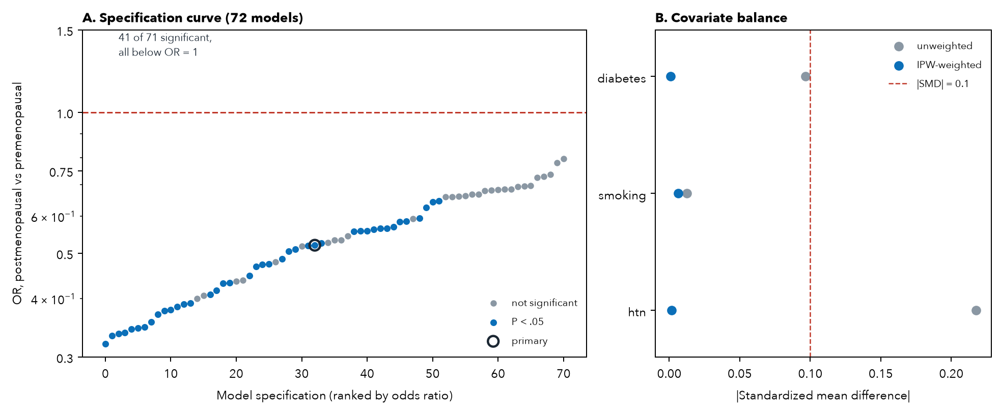
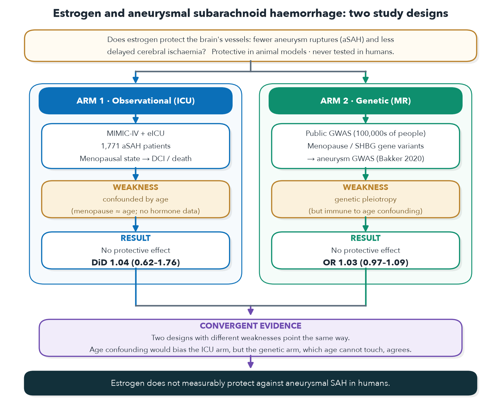

# Figures and tables

The display items for the study, organised as they would appear in the manuscript
and its online supplement. The manuscript text is not in this repository (this is
companion code, not the paper). The set follows STROBE and RECORD for the
observational arm, STROBE-MR (Skrivankova 2021) for the genetic arm, and the
reporting conventions for complementary observational and genetic designs (estimand
table + causal diagram).

Every figure is regenerated by its script in `figures/`; data-driven figures read
the analysis outputs in `mr/outputs/` and `icu/outputs/`.

---

# Main displays

## Figure 1. Study design and causal diagrams

The two arms as Data → Design → Analysis pipelines (A), and the causal diagrams
that motivate them (B). In the observational arm, age both defines the exposure and
drives vasospasm, and ICU admission is a selection node; in the genetic arm,
variants fixed at conception instrument menopausal timing and bypass age, with the
dashed path the pleiotropy assumption that the sensitivity analyses test.

## Figure 2. Participant flow

Selection of the aneurysmal SAH cohort from MIMIC-IV and eICU admissions, with
exclusions, the sex split, and the premenopausal-versus-postmenopausal primary
contrast. n = 1,771 aSAH admissions (1,105 women, 666 men).

## Figure 3. Results, both designs (table with embedded forest plot)

Point estimates and 95% confidence intervals across both arms, grouped by design,
with a forest column on a shared log-odds-ratio axis (reference line at OR = 1) and
the numeric estimates and P values alongside. Observational estimates are per
menopausal stratum; genetic estimates are per year or per standard deviation of the
exposure; the positive control (menopause → breast cancer) is a different outcome
shown to validate the genetic pipeline.

Model specification (what is the outcome, the exposure, and the covariates):

- **Observational, menopausal contrast (logistic regression):**
  `logit P(DCI = 1) = β0 + β1·postmenopausal + β2·hypertension + β3·smoking + β4·diabetes`,
  with cluster-robust standard errors by hospital. The **outcome (Y)** is delayed
  cerebral ischaemia (binary); the **exposure** is postmenopausal versus
  premenopausal (postmenopausal = 1 if age ≥ 51, else 0); the **covariates** are
  hypertension, smoking, and diabetes. The reported odds ratio is `exp(β1)`. Age is
  deliberately **not** a covariate because it defines the exposure, so adjusting for
  it removes the contrast.
- **Observational, age-by-sex difference-in-differences:** the change in delayed
  cerebral ischaemia across the menopausal age cutoff in women, minus the
  corresponding age change in men, so the reported odds-ratio ratio isolates any
  female-specific (menopause) effect from the shared ageing gradient.
- **Genetic (Mendelian randomization):** the **outcome (Y)** is aneurysm liability
  (log-odds from the GWAS); the **exposure** is genetically predicted age at natural
  menopause; the odds ratio is per one year (or per standard deviation) of later
  menopause, by random-effects inverse-variance weighting unless another estimator
  is named. The two multivariable-MR rows are mutually adjusted for the other
  hormone; the positive control is univariable (unadjusted) MR.

## Figure 4. Genetic arm (Mendelian randomization): later menopause across the disease course, with controls (table with forest)

This figure is entirely the genetic (Mendelian randomization) arm. Genetically
predicted age at natural menopause instrumented against unruptured
intracranial aneurysm (formation), aSAH (rupture), and combined intracranial
aneurysm (Bakker 2020, all null), with independent FinnGen replication and the
positive (breast cancer) and negative (appendicitis) instrument controls. Because
ruptured and unruptured aneurysms are near-genetically identical (rg ~0.97), the
three disease-course rows are a consistency check rather than independent stages;
the controls show the instrument detects a real hormonal effect and does not
associate with an unrelated outcome.

Model specification (Mendelian randomization). For each genetic instrument (SNP)
`j`, `βx_j` is its effect on the **exposure** (age at natural menopause, per year)
and `βy_j` its effect on the **outcome (Y)** (aneurysm liability, on the log-odds
scale). The per-SNP causal estimate is the Wald ratio `βy_j / βx_j`, and these are
pooled by random-effects inverse-variance weighting:
`β_IVW = Σ(βx_j·βy_j / σy_j²) / Σ(βx_j² / σy_j²)`, with the reported odds ratio
`exp(β_IVW)` per one year of later menopause. There are no covariates: random
allocation of alleles at conception, not statistical adjustment, is what controls
for confounding, so the genetic arm needs no age or lifestyle covariates (the
central reason it is not confounded by age the way the observational arm is).

## Table 1. Baseline characteristics of the aSAH cohort, by menopausal stratum

Demographics, comorbidities, illness severity, and outcomes for the pooled MIMIC-IV
+ eICU cohort. APACHE is recorded in eICU only; comorbidities are from diagnosis
codes. The higher crude DCI in premenopausal women alongside their lower mortality
reflects the competing-risk and age structure discussed in the paper, not an
estrogen effect.

## Table 2. Estimand comparison across the two designs

| | Arm 1, Observational (ICU) | Arm 2, Genetic (Mendelian randomization) |
|---|---|---|
| **Exposure** | Menopausal state (age-based proxy: <51 vs ≥51) | Genetically predicted age at natural menopause |
| **Outcome node** | Delayed cerebral ischaemia, conditional on aSAH admission | aSAH liability (aneurysm rupture) |
| **Dominant bias** | Confounding by age; ICU selection | Horizontal pleiotropy |
| **Can identify** | Whether menopausal state (mostly age) tracks DCI in admitted patients | Causal effect of menopausal timing on rupture, free of age confounding |
| **Cannot identify** | An estrogen effect separable from age | The DCI node (no DCI GWAS); a female-specific effect |
| **Result** | OR 0.52 (0.41–0.66), significant but non-identifiable (age artifact) | IVW OR 1.03/yr (0.97–1.09); excludes protection > OR 0.90/SD |

---

# Supplementary displays

## eFigure 1. Why the observational contrast is not identifiable

(A) Age distribution by group: premenopausal (19-50 y) and postmenopausal (51-91 y)
women occupy disjoint age ranges (zero common support), while men span the whole
range and supply the ageing reference for the difference-in-differences. This is a
positivity violation, not a collinearity problem (variance-inflation factor ~2.3).
(B) Delayed-cerebral-ischaemia rate by age in women and men: DCI falls with age in
both sexes with no menopause-specific step at 51, so the apparent postmenopausal
"protection" (OR 0.52) is the shared age gradient; the age-by-sex
difference-in-differences that removes it is null (1.04, 0.62-1.76).

## eFigure 2. Mendelian randomization diagnostics

STROBE-MR sensitivity plots for age at natural menopause on aSAH: (A) scatter of
SNP-outcome vs SNP-exposure effects with IVW and MR-Egger lines; (B) funnel plot;
(C) leave-one-out estimates; (D) positive-control scatter (menopause → breast
cancer), which recovers a clear positive slope and validates the pipeline.

## eFigure 3. Observational-arm diagnostics

(A) Specification curve of the menopause → DCI odds ratio across all 72 defensible
models: every significant fit falls below OR = 1, the signature of age confounding
rather than an estrogen effect. (B) Covariate balance before and after
inverse-probability weighting.

## eTable 1. Full Mendelian-randomization results

Outcome is aneurysmal SAH (Bakker 2020, European, UK-Biobank-excluded) unless
stated. Random-effects IVW; distance clumping unless noted.

| Analysis | Exposure | Instruments | OR (95% CI) | P | Notes |
|---|---|---|---|---|---|
| Primary | Age at natural menopause, per year | 85 | 1.03 (0.97–1.09) | .32 | Steiger 80/85; Egger P .19; MR-PRESSO P .17; LOO 1.01–1.04; F 98 |
| Primary, per SD | Age at natural menopause, per SD | 85 | 1.12 (0.91–1.38) | n/a | 80% MDE OR 0.73; TOST excludes protection > OR 0.90/SD (P .027), not null/harm (.53) |
| Positive control | Age at menopause → breast cancer | 207 | 1.055 (1.041–1.069) | <.001 | validates the pipeline |
| Single-exposure | SHBG, women, per SD | 82 | 0.73 (0.41–1.31) | .29 | opposite side of null from Molenberg 2022 (1.18) |
| Single-exposure | Total testosterone, per SD | 58 | 0.98 (0.77–1.27) | .91 | Egger intercept P .04 |
| Multivariable | SHBG, women (adj. testosterone) | 106 | 1.06 (0.50–2.28) | .88 | SHBG point moves 0.73 → 1.06 |
| Multivariable | Bioavailable testosterone (adj. SHBG) | 106 | 1.03 (0.57–1.86) | .93 | |
| Sensitivity | Clumping windows 250 kb–5 Mb | 61–107 | 1.02–1.03 | n/a | stable to clumping stringency |
| Sensitivity | r² LD clumping (PLINK, 1000G EUR) | 81 | 1.03 (0.98–1.09) | .22 | gold-standard clumping confirms the primary |

## eTable 2. Phenotype code lists

Exposure, outcome, and covariate definitions (ICD-9/10 codes and eICU strings) are
version-controlled at `icu/config/codelists/*.yaml` (SAH, aneurysm, aneurysm
procedures, vasospasm, DCI procedures, HRT, comorbidities, eICU aSAH strings).

## eTable 3. Genetic instruments

Per-SNP harmonized exposure and outcome effects with F-statistics for the 85
menopause instruments (mean F = 98, all > 10). See
[`tables/etable3_instruments.md`](tables/etable3_instruments.md).

## eTable 4. Power and equivalence

Effective outcome sample ≈ 17,000 (Bakker aSAH-Euro, UKB-excluded). Minimum
detectable effect at 80% power: OR 0.73 per SD. Power to detect OR 0.90 per SD:
15%. Two-one-sided equivalence test against a smallest effect of interest of OR
0.90 per SD: strong protection rejected (P .027), strong harm not rejected (P .53),
so the honest statement is a bounded null, not equivalence.

## eTable 5. Reporting checklists

STROBE / RECORD (observational arm) and STROBE-MR (genetic arm) item-by-item
checklists accompany the manuscript submission.

---

# Visual summary

The full workflow and the graphical abstract.

---

# Numbered exports for submission

`python figures/export_final.py` renders every display to `figures/final/` as a
numbered PNG, PDF, and SVG (vector PDF/SVG come straight from matplotlib). The order
prefix keeps them sorted as they appear in the paper:

| File (stem) | Display | Source script |
|---|---|---|
| `1.Figure_1_study_design` | Figure 1, study design | `study_methods.py` |
| `2.Figure_2_participant_flow` | Figure 2, participant flow | `cohort_flow.py` |
| `3.Figure_3_results_forest_table` | Figure 3, results (both designs) | `results_forest_table.py` |
| `4.Figure_4_cascade_forest` | Figure 4, disease-course cascade + controls | `mr_cascade.py` |
| `5.Table_1_baseline_characteristics` | Table 1, baseline characteristics | `table1_figure.py` |
| `6.eFigure_1_causal_diagrams` | eFigure, causal diagrams | `dag.py` |
| `7.eFigure_2_nonidentifiability` | eFigure 1, non-identifiability | `overlap_nonidentifiability.py` |
| `8.eFigure_3_mr_diagnostics` | eFigure 2, MR diagnostics | `mr_diagnostics.py` |
| `9.eFigure_4_observational_diagnostics` | eFigure 3, observational diagnostics | `observational_diagnostics.py` |
| `10.Visual_graphical_abstract` | Graphical abstract | `graphical_abstract.py` |
| `11.Visual_workflow_overview` | Workflow overview | `study_workflow.py` |

The CNS conference abstract with five embedded figures is built to
`manuscript/cns_abstract.docx` from `manuscript/cns_abstract_submission.md`
(`pandoc cns_abstract_submission.md -o cns_abstract.docx`).

*Regenerate any single figure with `python figures/<name>.py`. Data-driven figures
require the analysis outputs first: run the `mr/` and `icu/` pipelines, then
`mr/scripts/export_figure_data.py`.*
