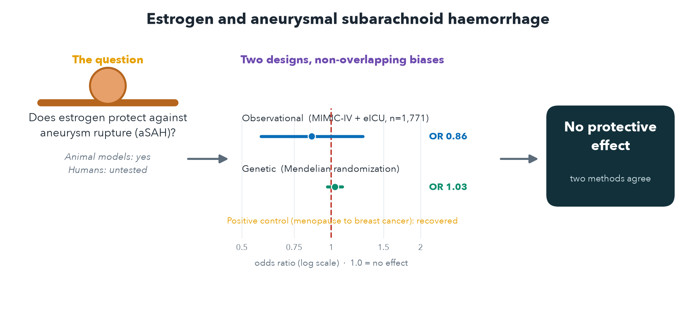

# Estrogen and aneurysmal subarachnoid haemorrhage: two study designs

Does estrogen protect against aneurysmal subarachnoid haemorrhage (aSAH)? Animal
models say yes; it had not been tested in humans with a design that separates
estrogen from age. This repository answers the question two ways whose weaknesses
do not overlap, and reads them together.

**The answer: no measurable protection.** A large protective effect is excluded; a
null or a small harmful effect cannot be. See `paper/` for the manuscript, figures,
and tables.



## Layout

```
paper/   the manuscript, figures (graphical abstract + Figures 1-3), and tables 1-2
icu/     Arm 1, observational: pooled MIMIC-IV + eICU aSAH cohort
mr/       Arm 2, genetic: two-sample Mendelian randomization on public GWAS
```

Each arm is a self-contained Python project with its own tests and reproduction.

## The two arms

**Arm 1, observational (`icu/`).** Pooled MIMIC-IV + eICU aSAH cohort (n = 1,771),
menopausal state versus delayed cerebral ischaemia. Adjusted OR 0.86 (0.58 to
1.28), but the design cannot identify an estrogen effect because menopausal state
is defined by age and no biological menopause marker is recorded. A specification
curve and an age-by-sex difference-in-differences model show the apparent signals
are age and ascertainment, not estrogen. The full pipeline runs on a committed
synthetic fixture with no credentialed data.

**Arm 2, genetic (`mr/`).** Two-sample Mendelian randomization of genetically
predicted age at natural menopause on aSAH (Bakker 2020). No protective effect
(IVW OR 1.03 per year, 0.97 to 1.09; excludes protection stronger than OR 0.90 per
SD). A positive control (menopause to breast cancer) recovers the known effect,
which validates the pipeline. Multivariable MR (SHBG with bioavailable
testosterone) and real r-squared LD clumping confirm the null.

## Run each arm

```bash
# Arm 1 (ICU)
cd icu && uv sync --extra dev && uv run pytest && make all   # synthetic unless config/paths.yaml is set

# Arm 2 (MR)
cd mr && uv sync --extra dev && uv run pytest                # estimator + QC tests (no data)
```

On exFAT or network volumes, set `export UV_LINK_MODE=copy UV_PROJECT_ENVIRONMENT=$HOME/.venvs/<name>` first.

## Data

No patient-level data or GWAS files are committed. MIMIC-IV and eICU-CRD need
PhysioNet credentialing; the GWAS are public (see `mr/docs/gwas_access.md`).

## Provenance

Consolidated from the two development repositories (`estrogen-asah-dci`,
`estrogen-aneurysm-mr`), whose commit histories hold the step-by-step development.

## License

Code: MIT. Uses only de-identified credentialed data and public GWAS summary
statistics under their respective terms.
